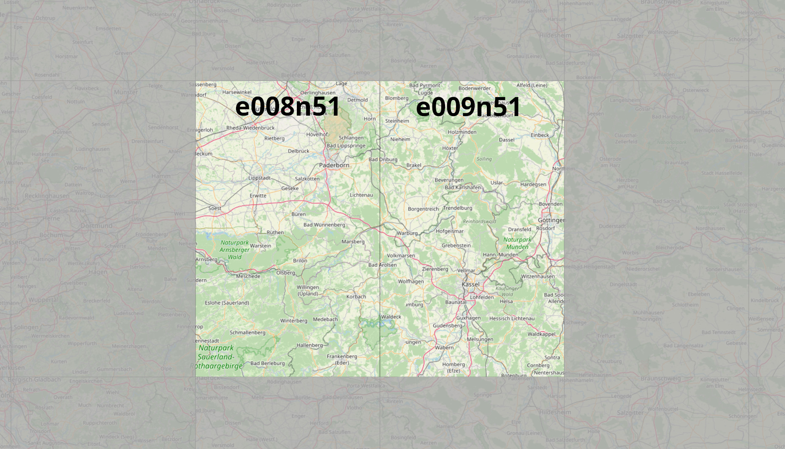

# Kassel-custom-scenery
FlightGear custom scenery for the Kassel region, Germany

### This package contains:

*  Kassel Airport (EDVK)
	* included new airport
	* custom main buildings
	* secondary buildings
	* ILS both runways
	* FMS procedures
* Old Kassel Calden Airport
	* closed but still visible
* Paderborn Lippstadt (EDLP)
	* upgraded airport layout
	* custom main buildings
	* secondary buildings
	* FMS procedures
* Allendorf Eder (EDFQ)
	* upgraded airport layout
	* custom main buildings
	* secondary buildings
	* FMS procedures
* Hoexter-Holzminden (EDVI)
	* upgraded airport layout
* Hameln- Bad Pyrmont (EDVW)
	* upgraded airport layout
* Fritzlar AB (ETHF)
	* upgraded airport layout
* Wolfhagen (EDGW)
	* upgraded airport layout
* Homberg Mosenberg (EDEM)
	* upgraded airport layout
* Edermünde - Grifte
	* upgraded airport layout
* Hessisch Lichtenau
	* upgraded airport layout
* Witzenhausen Burgberg
	* upgraded airport layout
* Hoelleberg (EDVL)
	* upgraded airport layout
* Uslar
	* upgraded airport layout
* Flugplatz Brakel
	* upgraded airport layout
* Ithwiesen (EDVT)
	* upgraded airport layout
* Blomberg-Borkhausen (EDVF)
	* upgraded airport layout
* Flugplatz Dehausen
	* upgraded airport layout
* Flugplatz Warburg
	* upgraded airport layout
* Flugplatz Vinsebeck
	* upgraded airport layout
* Korbach (EDGK)
	* upgraded airport layout
* Mengeringhausen (EDVG)
	* upgraded airport layout
* Schameder (EDGQ)
	* upgraded airport layout
* Schmallenberg-Rennefeld (EDKR)
	* upgraded airport layout
* Meschede-Schueren (EDKM)
	* upgraded airport layout
* Brilon-Hochsauerland (EDKO)
	* upgraded airport layout
* Oeventrop-Ruhrwiesen
	* upgraded airport layout
* Soest Bad Sassendorf (EDLZ)
	* upgraded airport layout
* Paderborn-Haxterberg (EDLR)
	* upgraded airport layout
* Oerlinghausen (EDLO)
	* upgraded airport layout
* Detmold (EDLJ)
	* upgraded airport layout
* Bielefeld- Windelsbleiche (EDLI)
	* upgraded airport layout
* [H] Bielefeld Rosenhoehe
	* upgraded helipad layout
* [clsd] Guetersloh AB (ETUO)
	* upgraded airport layout
* Beelen (EDLQ)
	* upgraded airport layout
* Oelde-Bergeler (EDLU)
	* upgraded airport layout
        

        
### Requirements:

* latest set of shared objects:
	http://flightgear.sourceforge.net/scenery/Models/
        
### Data sources:

* SRTM-3 global elevation data:
	http://viewfinderpanoramas.org/Coverage%20map%20viewfinderpanoramas_org3.htm
* CORINE landcover data:
	https://land.copernicus.eu/pan-european/corine-land-cover/clc2018?tab=mapview
* OSM landmass data:
	https://osmdata.openstreetmap.de/data/land-polygons.html
* x-Plane detailed airports:
	https://gateway.x-plane.com
* FlightGear terrasync objects:
	https://scenery.flightgear.org/
* FMS-procedures hosted by pinto:
	https://github.com/l0k1/fg-navaiddata
* osm2city:
	https://gitlab.com/osm2city
* osm raw data:
	https://download.geofabrik.de/

### Special thanks to:

* D-ECHO
* d-laser (https://github.com/mherweg/d-laser-fgtools)
    
    
Sven Seipp, Jan 2022
